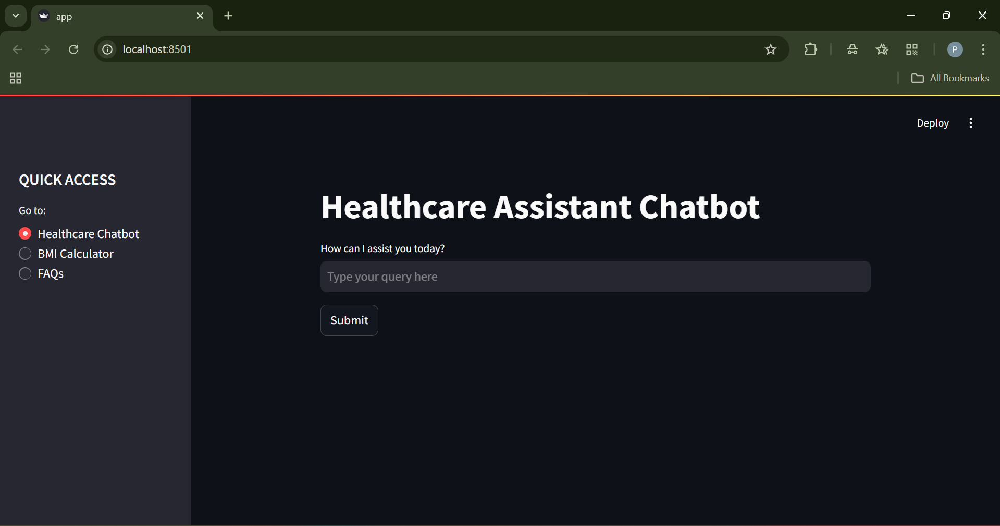
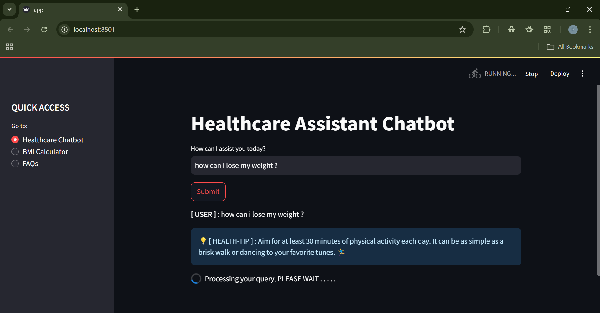
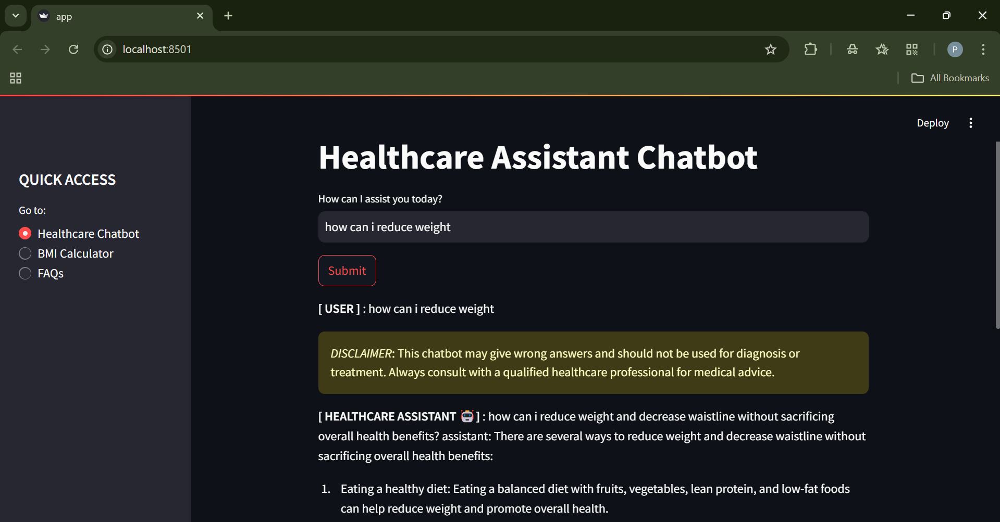
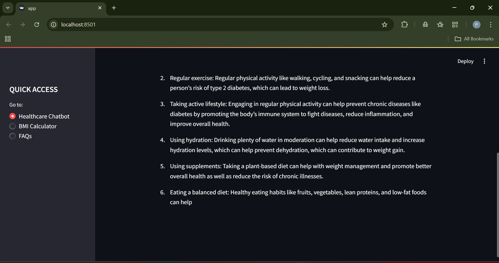
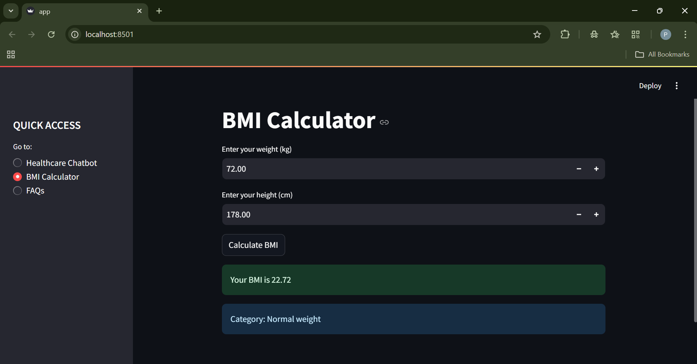
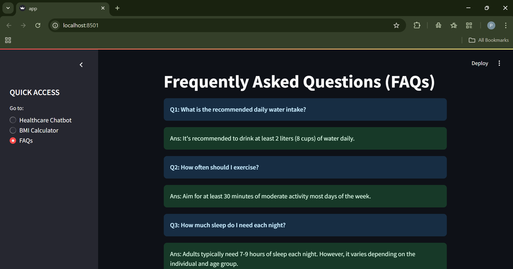

# 🏥 Healthcare Assistant Chatbot 🤖

An interactive **Streamlit** web app that serves as a basic **Healthcare Assistant Chatbot**, offering:

- 💬 AI-powered chatbot for health-related queries  
- 🧮 BMI (Body Mass Index) calculator  
- ❓ Frequently Asked Questions (FAQs) section  
- 💡 Dynamic health tips with each interaction  

> ⚠️ **Disclaimer:** This app is for **informational purposes only** and **not** intended for diagnosis or treatment. Always consult a qualified medical professional.

---

## 🚀 Features

### ✅ 1. Healthcare Chatbot  
- Responds to user queries using:
  - Predefined logic for common health-related terms
  - AI-generated responses via a fine-tuned GPT-2 model (`Sharathhebbar24/chat_gpt2_dpo`)
- Displays a helpful health tip with each response
- Shows a disclaimer to avoid misuse

### ✅ 2. BMI Calculator  
- Input your **weight (kg)** and **height (cm)**
- Calculates BMI and classifies into:
  - Underweight
  - Normal
  - Overweight
  - Obese

### ✅ 3. FAQs Section  
- Displays frequently asked health questions and trusted answers
- Topics include water intake, sleep, exercise, meditation, and more

---

## 🛠 Tech Stack

| Tool           | Usage                                  |
|----------------|----------------------------------------|
| Python         | Core programming language              |
| Streamlit      | Front-end web interface                |
| Transformers   | AI-powered chatbot (Hugging Face)      |
| NLTK           | Natural Language Toolkit for NLP       |

---

## 📦 Installation

### 1. Clone the repository

```bash
git clone https://github.com/PrabjyotSingh2904/AI-Powered-Health-Assistant.git
cd AI-Powered-Health-Assistant
```
### 2. Install dependencies
```bash 
pip install -r requirements.txt
```

Contents of requirements.txt:
- streamlit
- transformers
- tensorflow
- nltk
- tf-keras
- torch


### 3. Download NLTK data (optional for first-time use)
```
import nltk
nltk.download('punkt')
nltk.download('stopwords')
```
---
## ▶️ How to Run the App

Start the Streamlit server:
```bash 
streamlit run app.py
```

The app will launch in your browser at:
📍 http://localhost:8501

---

## 📁 File Structure
```
├── app.py                # Main Streamlit application
├── README.md             # Project documentation
├── requirements.txt      # Python dependencies
```
---
## 🤖 Model Info

- Uses a custom fine-tuned GPT-2 model for healthcare-like conversation
- Model hosted on Hugging Face
- Model name: Sharathhebbar24/chat_gpt2_dpo

💡 You can swap the model with any other text-generation model compatible 

---
## 📸 Screenshots

### 1. Chatbot Interface and Working
  
  
  
  

 ### 2. BMI Calculator Page
  

 ### 3. FAQs Page
  


---

## 🤖 Special Thanks

Thank you to the creators of the fine-tuned GPT-2 model [`Sharathhebbar24/chat_gpt2_dpo`](https://huggingface.co/Sharathhebbar24/chat_gpt2_dpo) used in this project for enabling healthcare-like conversations.

---

## 📄 License

This project is licensed under the MIT License.


